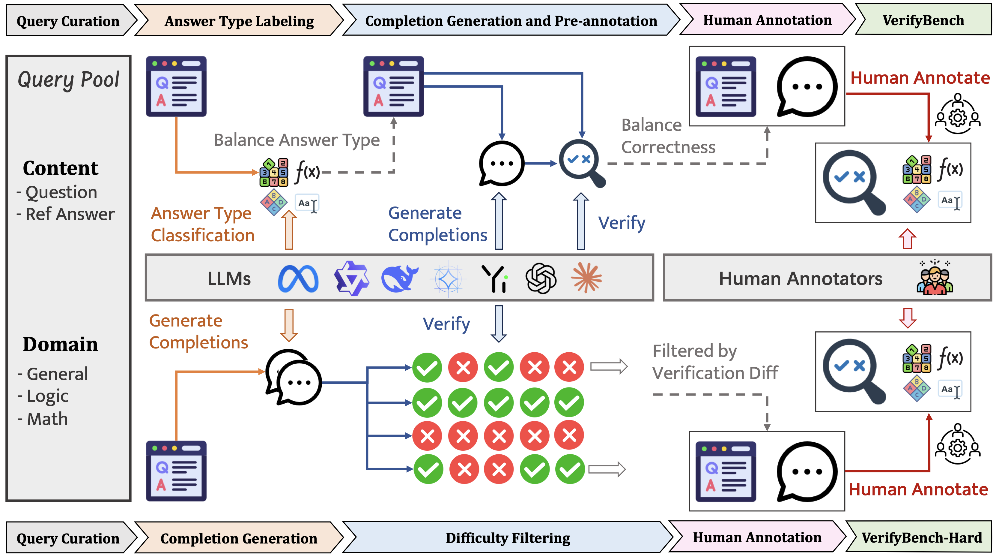

<div align="center">
     <h1>VerifyBench: Benchmarking Reference-based Reward Systems for Large Language Models</h2>
</div>

<p align="center">
  <strong>Yuchen Yan<sup>1,2,*</sup></strong>,
  Jin Jiang<sup>2,3</sup>,
  Zhenbang Ren<sup>1,4</sup>,
  Yijun Li<sup>1</sup>,
  Xudong Cai<sup>1</sup>,
  Yang Liu<sup>2</sup>,
  <br>
  Xin Xu<sup>5</sup>,
  Mengdi Zhang<sup>2</sup>,
  <strong>Jian Shao<sup>1,†</sup></strong>,  
  <strong>Yongliang Shen<sup>1,†</sup></strong>,  
  Jun Xiao<sup>1</sup>,
  Yueting Zhuang<sup>1</sup>
</p>
<p align="center">
  <sup>1</sup>Zhejiang University  
  <sup>2</sup>Meituan Group
  <sup>3</sup>Peking university
  <br>
  <sup>4</sup>University of Electronic Science and Technology of China
  <br>
  <sup>5</sup>The Hong Kong University of Science and Technology
  <br>
  <em>ICLR 2026</em>  
  <br>
  <sup>*</sup>Contribution during internship at Meituan Group, <sup>†</sup>Corresponding Author
</p>

<p align="center">
🤗 <a href="https://huggingface.co/datasets/ZJU-REAL/VerifyBench">Dataset</a> |
 <a href="https://arxiv.org/abs/2505.15801">Arxiv</a> 
| 📑 <a href="https://zju-real.github.io/VerifyBench/">WebPage</a> 
<br>
</p>

## News 🔥🔥
- **2026.01.26:** VerifyBench has been accepted by ICLR 2026. 
- **2025.05.29:** Code for evaluation is available.
- **2025.05.25:** Home page is available.
- **2025.05.22:** We release our paper.

## Overview 🦾🦾

In this paper, we present VerifyBench, a benchmark specifically designed to evaluate the accuracy of reference-based reward systems. To create VerifyBench, we curated a diverse collection of instructions paired with reference answers sourced from existing open datasets. Responses to these instructions were generated by multiple open-source and proprietary LLMs. The correctness of each response was assessed using both automated model judgments and human evaluations. Each instance in VerifyBench was verified by at least two human annotators to ensure label consistency and reliability, thereby producing a high-quality benchmark for the evaluation of reward systems.

Recognizing the need to differentiate between various verification techniques and to push the boundaries of current capabilities, we further developed VerifyBench-Hard, a more challenging variant of our benchmark. This dataset focuses on contentious cases where leading models produce highly conflicting judgments, providing a more stringent test for reward system accuracy. VerifyBench-Hard samples were carefully selected based on disagreement patterns among high-performing models, then subjected to thorough human annotation to ensure label quality.

Our contributions can be summarized as follows:  
-  To better reflect realistic reinforcement learning (RL) scenarios for reasoning models, we construct VerifyBench, a benchmark derived from existing models and datasets, to provide an objective evaluation of the accuracy of reference-based reward systems.
- We further develop VerifyBench-Hard, a more challenging benchmark curated from cases exhibiting high disagreement among multiple models. This dataset contains a larger proportion of difficult-to-verify samples, highlighting substantial potential for improvement in current models.
- We conduct a comprehensive empirical analysis of model performance on both VerifyBench and VerifyBench-Hard, offering actionable insights to advance the accuracy of reference-based reward systems and enhance RL training in reasoning tasks.

## Try VerifyBench!
Run `evaluate.py` to test your own models on VerifyBench and VerifyBench-Hard.
```bash
# for VerifyBench
python3 evaluate.py --model_name_or_path <your_model_path>

# for VerifyBench-Hard
python3 evaluate.py --model_name_or_path <your_model_path> --hard

# for No-Reference scenario
python3 evaluate.py --model_name_or_path <your_model_path> --wo-ref
```
  
## Citation

If you find our work helpful, feel free to give us a cite.

```
@inproceedings{
    yan2026verifybench,
    title={VerifyBench: Benchmarking Reference-based Reward Systems for Large Language Models},
    author={Yuchen Yan and Jin Jiang and Zhenbang Ren and Yijun Li and Xudong Cai and Yang Liu and Xin Xu and Mengdi Zhang and Jian Shao and Yongliang Shen and Jun Xiao and Yueting Zhuang},
    booktitle={The Fourteenth International Conference on Learning Representations},
    year={2026},
    url={https://openreview.net/forum?id=JfsjGmuFxz}
}
```

## Contact Us
If you have any questions, please contact us by email: 
yanyuchen@zju.edu.cn
